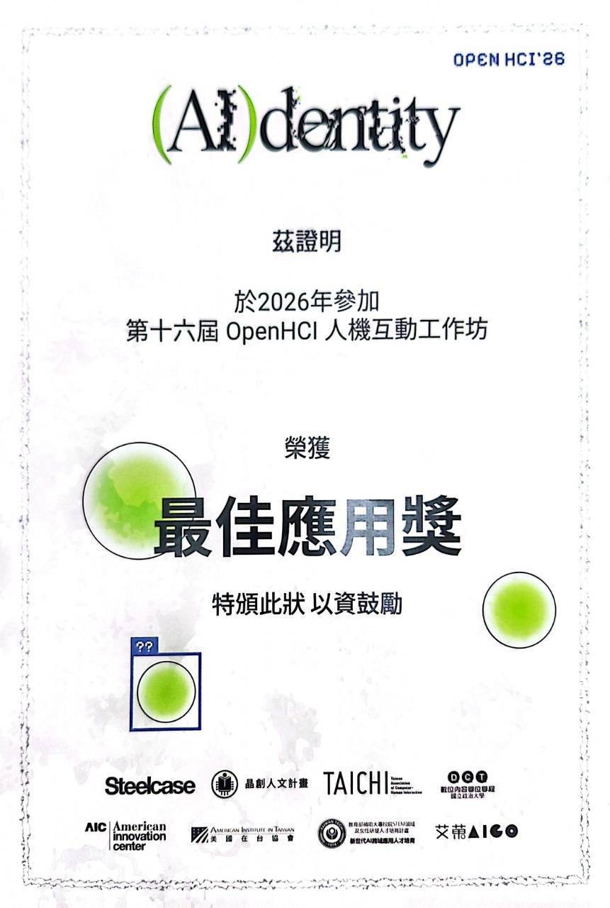

# OpenHCI

An AI photo booth that keeps the photographer in charge. AI proposes a "ghost": a reference of how your shot could look. You decide whether to match it, drift from it, or shoot your own version.

Production source for `https://openhci.cechung.com`.

🏆 OpenHCI 2026 Best Application Award & Best Popularity Award · TAICHI 2026 Demo
<div align="center">
  
</div>


## How it works
Say what you want. A free-form request is expanded into an editable Intent Profile (subject, pose, composition, camera angle, background, color, mood). You confirm up to three priorities.
AI proposes a ghost. A generated reference image is split into capture-time direction (pose, placement, angle) and a post-production look (color, contrast, filters) to apply later.
Shoot with live guidance. In-browser pose detection, a horizon check, and the phone's orientation sensor drive one hint at a time. Each hint states an action and its reason, and can be skipped or paused.
Edit and review. The unfiltered original is kept, a non-destructive editor applies the AI look, and a receipt shows how close you got on pose, placement, composition, and look. The final judgment stays with you.

Camera frames, pose landmarks, and sensor data never leave the browser.

## Tech stack
Frontend: vanilla JavaScript, MediaPipe Pose Landmarker (Tasks Vision), Canvas, DeviceOrientation API, IndexedDB
AI: Gemini image models via Vertex AI, with automatic OpenAI fallback (gpt-image, gpt-5-mini)
Backend: Cloudflare Workers, R2 (session backups), Durable Objects (daily generation budget)
Testing: Node.js test runner (18 test suites)


## Local Development

```bash
cd site
npm install
npm run dev
```

Open the local Wrangler URL. Camera features work best on localhost or HTTPS.

## Deploy

The deployed app lives in `site/`:

- `site/public/` - static pages served on the domain.
- `site/src/index.js` - Cloudflare Worker API proxy for AI routes.
- `site/wrangler.jsonc` - Worker, assets, vars, and route config.

Cloudflare Workers Builds deploys the repository branches to separate sites:

- `develop` -> `https://staging.openhci.cechung.com`
- `main` -> `https://openhci.cechung.com`

Create feature branches from `develop`. Merge them back into `develop`, verify
the staging site, then open a release PR from `develop` to `main`.

Manual production fallback:

```bash
cd site
npm run deploy
```

Manual staging fallback:

```bash
cd site
npm run deploy:staging
```

Do not commit `.dev.vars` or real API keys.


## Corresponding Links
- OpenHCI 2026: `https://2026.openhci.com/`
- topic intro: `https://docs.google.com/presentation/d/1xUU9dbr_afdRIzz_zAPt97m13knM6yv3zmDzy6sXE3k/edit?slide=id.p#slide=id.p`
- backgroud setting: `https://docs.google.com/document/d/1dhDyvuxMloYV5tt8KLq2KYFtI7d-tB_lN9rHu1ZOTAM/edit?tab=t.0`
- user interview: `https://docs.google.com/document/d/1rElun6Dwfset_RYR_jgghD_2VS8Mc3iD_Sfb0kFH9I8/edit?tab=t.rmt9ez1vrtd6#heading=h.ybtibt6k10v7`
- proposal slide: `https://docs.google.com/presentation/d/1qCfLpK0jMpeGWZamnkbu4B4vRRhIBYKV/edit?slide=id.p1#slide=id.p1`
- final presentation slide: `https://www.canva.com/design/DAHPu3ZkM7k/Z89CbXuNdaA1PLSYGonvRg/edit`
